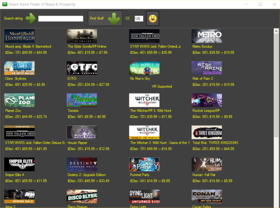

# SteamGameFinder
Query the Steam store and use HtmlAgilityPack to dig through the mess

## HOW DO I STEAM

The url for talking to the Steam store _seems_ undocumented, at least I couldn't find information on it anywhere. Credit for the url goes to [swiftyspiffy](https://github.com/swiftyspiffy/SteamStoreQuery), where I found it.

##### now what

What Steam returns is pictured below (pseudo-formatted by me), so dealing with that is either going to require a lot of string ops or something like the HtmlAgilityPack to identify the nodes. When we figure out where the data is, we pull it out, stick it into controls and stuff the whole mess into a flowlayoutpanel. But this is only going to work until Steam decides to change something.

Added functions to read games on sale.

     

     

I'm looking at you, Metro Exodus 0.o

     

